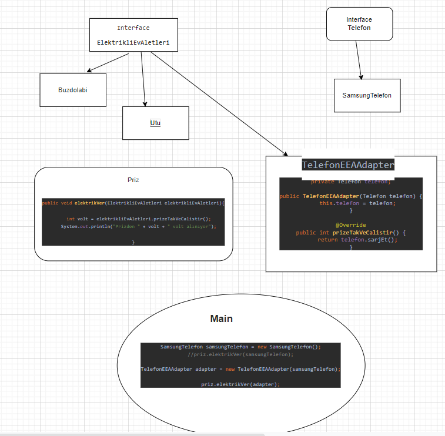

# Design Pattern
 
 
Design Pattern proqramlaşdırma mühitinde tez-tez ortaya çıxan problemlerə ümumi həll üsuludur . Bu üsullar proqramlaşdırma dillərindən müstəqil olaraq problemin həlli üçün ümumi bir logic olaraq inkişaf etmişdir

# 1.Factory Pattern
  Bir class yaratmaq isdədikdə  hansı alt classın lazım olduğunu bilmədikdə factory pattern-dən istifadə edirik . Factory Pattern-in köməyi ilə biz yazdığımız kodda SOLID-ın qanunlarınada riyayət etmiş oluruq . Loosly couple kod yazmış oluruq beləliklədə yazdığımız kodun həm oxunması həmde baxımi asand olur . 

# 2.Abstract Factory Pattern
  Abstract Factory Pattern prinsip etibari ilə factory pattern-dən əhəmiyyətli dərəcədə fərqlənmir . Buradakı başlıca fərq isə digər fabrikaları yaradan super fabrikin olmasıdır . Bu fabrikə fabriklər fabrikidə deyirlər . Qalan logic isə factory pattern ilə tamamilə eynidir.
Aşağıda proyekt içersindəki kodun sxemi verilmişdir . Buna əsasən deyə bilərikki əvvəlce Factory-dən  Bank Factory yaranir sonraki addımda isə Bank Factoryden Bank yaranir .

# 3.Singleton Pattern
  Singleton Pattern ən çox istifadə olunan patternlərdən biridir . Burada əsas məqsəd bir classın obyektinin yalnız bir dəfə yaradılmasına icazə verməkdir . Bunun üçün isə classın constructor-unu private edib class içində static bir methodda həmin classın obyektini yaratmaqdır . Və  obyekt yaratmaq lazım olduqda isə həmin static methodu çağırmaq kifayətdir . Burada class-ı final elan edərək onnan başqa classaların extends etmesini əngəlləyə bilərik və beləliklədə classımız immutable olur.
 
# 4.Builder Pattern

  Creational pattern-lərin bir növü olan bu patterndə çox geniş şəkildə istifadə olunur . Burada əsas məqsəd class yaratdığımızda constuctor-ları doldurduqda daha asan şəkildə seçim etməkdir . Nümunə olaraq 2 fərqli kod nümunəsi göstərmişəm . Builder istifədə edərək constructor-da yalnız isdədiyimiz field-ları doldururuq boş  fieldlar isə default qiymət alır.
Builder pattern-dən istifadə üçün lombok kitabxanası bizim üçün köməklik edir . Proyektlərimizin pom.xml hissəsindən lombok kitabxanasını əlavə edib pojo classımızın başına @Builer annotation-nı əlavə etsək həmin class-ın obyektini builder pattern üsulu ilə yarada bilərik . Bu isə bizə bir çox avantajlar verir.
Bunun isə işləmə məntiqi bəsitdir deməli JVM arxada @Builer annotation-nı əlavə edilmiş classın bənzəri bir classı yaradır(Bizim nümunəmizdəki EvBuilder kimi ) və ona builder özəlliyini verir. Biz isə bunlardan xəbərsiz sadəcə obyektlərnən işliyirik
Bu isə kodumuzda yer alan biraz daha fərqli bir builder pattern istifədəsidir 

# 5.Prototype Pattern
  Prototype pattern-də creational pattern-lərin bir növüdür . Buradakı strategiya isə bir pojo class-nı Cloneable interface-indən implements etməkdir.Bundan sonra isə clone() methodunu override edirik və casting prosesini yerindəcə aparırıq . Ondan sonra isə obyekt yaratmaq lazım olduqda bu methodu clone etmək isdədiyimiz referansı istifadə edərək çağırırıq . Neticədə yaratdığımız yeni obyekt digər obyektin dəyərlərini daşıyacaq . 
Prototip Pattern deyir ki, yenisini yaratmaq əvəzinə mövcud obyektin klonlanması və tələbə uyğun olaraq da fərdiləşdirilə bilər.
Yeni obyektin yaradılmasının dəyəri bahalı və resurs tələb edirsə prototype pattern-dən istifadə edirik.

# 6.Adapter Pattern

Adapter pattern iki uyğunsuz interfeys arasında körpü rolunu oynayır. Bu tip dizayn nümunəsi structural pattern hesab edilir , çünki bu model iki müstəqil interfeysin imkanlarını birləşdirir.
Bu nümunə müstəqil və ya uyğun gəlməyən interfeyslərin funksiyalarını birləşdirməyə cavabdeh olan tək bir sinfi əhatə edir. Böyük veb proyektlərində bu pattern-ə çox rast gəlinir . İki uyğunsuz service class-larının adaptasiya olunmasında istifadə edilir . Və eyni zamanda Spring Boot-da yazdığımız restfull app-lərə xarici dünyadan digər SOAP service-ləri adaptasiya edərkən istifadə olunur . 
Aşağıda adapter pattern-ə aid vəzyət simuliyasiya olunub.

Real proyektə adapter pattern-in necə işlədiyini görmək isdiyirsənsə linkə bax 
https://github.com/GurbanAlizada/hrms

# 7.Proxy Pattern

Proxy pattern class başqa bir class-ın funksionallığını təmsil edir. Proxy modelində biz onun funksionallığını xarici dünya ilə əlaqələndirmək üçün orijinal obyekti olan obyekt yaradırıq.
Proxy pattern-dəki məntiqi Spring Boot proyektlərindəki repository class-larıni (interface-lərini) service class-larında işlətərkən görürük . Burada da repository siniflərimiz private olaraq elan edilir (və eyni zamanda @Autowired annotation-ın köməyi ilə injektə olunur) və müəyyən logic şərtlərini yerine yetirildikdə icra olunur .
Burada proxy pattern işlədilmir sadacə məntiqi olaraq proseslər oxşardır.

# 8.Iterator Pattern
İterator pattern Java və .Net proqramlaşdırma mühitində çox istifadə olunan dizayn pattern-dir. Bu nümunə kolleksiya obyektinin elementlərinə onun əsas təsvirini bilmək ehtiyacı olmadan ardıcıl şəkildə daxil olmaq üçün istifadə olunur.

Bu materialda https://www.youtube.com/watch?v=5DOEhu7LwKg&list=PLLCTYkJ1vsDDoE7CJ_xfd373RKah1V0y9&index=1 youtube kanalından və https://www.javatpoint.com/design-patterns-in-java saytından məlumatlar istifadə olunub